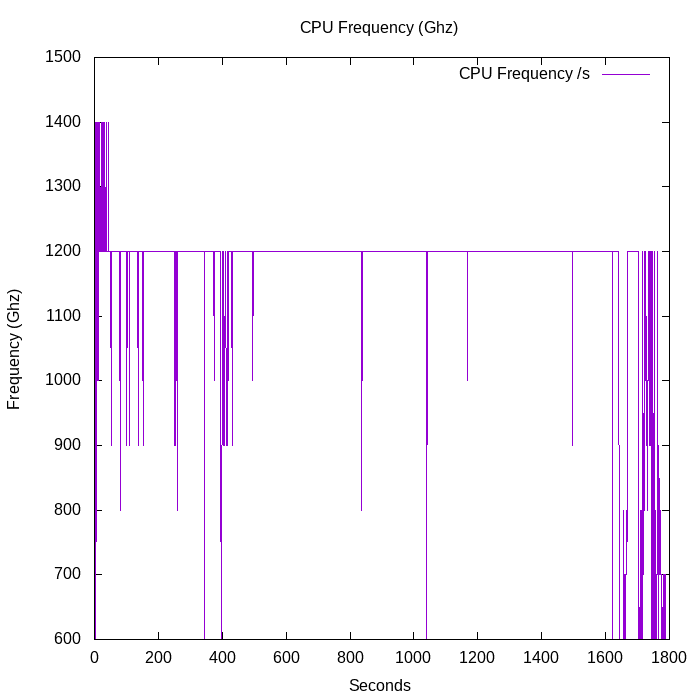
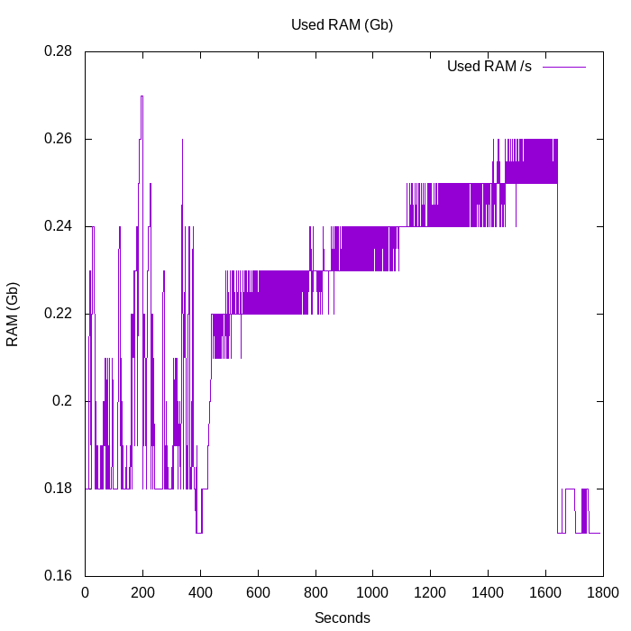

<h1>RMIT - UNIX Assignment 2</h1>
<h2>S3579878 - David Poiner</h2>
<h4>This is the report generated after compiling the custom kernel 5.10.63-s3579878+</h4>

Below you will see the output of the results.dat files after passing through the gnuplot and being graphed as .png files

<ul>
<li>CPU Temperature (Celcius)</li>
<li>GPU Temperature (Celcius)</li>
<li>CPU Frequency (Gigahertz)</li>
<li>Used RAM (Gigabytes)</li>
<li>Free RAM (Gigabytes)</li>
<li>Available RAM (Gigabytes)</li>
<li >CPU Usage (still in production)</li>
</ul>
<h2>CPU Temperature</h2>

The below image displays the CPU temperature while compiling the kernel. CPU Temperature is taken from '/sys/class/thermal/thermal_zone0/temp', converted into celcius and results are displayed within to two decimal points. The Raspberry Pi's processor is built to withstand temperatures from -40°?C to 85°?C ([source](https://pimylifeup.com/raspberry-pi-temperature/#:~:text=Officially%20the%20Raspberry%20Pi's%20processor,C%20to%2085%C2%B0C.))

<h2>GPU Temperature</h2>

This image displays the GPU (video card) temperature during the process the readings are called using the 'vcgenmd measure_temp' command in the profScript. This readout is collected and has to have 'temp=' and 'C' removed using the cut command, it is them stored within two decimal places using awk.

<h2>CPU Frequency</h2>

The Raspberry Pi's CPU frequency (or clock speed) is how many cycles per second is can execute. This is recorded using 'vcgencmd measure_clock_arm' and is converted from Hertz to Gigahertz by dividing the Hertz readout by 1,000,000. The readout then has to be cut (similar to the GPU temperature) before it can be stored in the results.dat file so that gnuplot can use the dat for create graphs

<h2>Used, Free and Cached RAM</h2>

All three of these readouts are collected using the 'free' command  and awk is used to make sure the readouts are displayed within two decimal places. 'Used' shows how much RAM has been used during the kernel compilation, 'Free' shows how much RAM was free during the compilation and 'Cached' RAM showed how much cahced memory has been stored in your RAM cache during the process.

<h2></a>CPU Usage (Still being worked on)</h2>

CPU Usage is gathered using the mpstat command. mpstat reports processor related statistics on the CPU cores and accurately displays the CPU usage of the system. You can view this in a normal terminal window if you type 'mpstat 1 1', this will shot you a one second snapshot of the cpu. At present this section is not yet completed.

&lt;IMAGE NOT AVAILABLE&gt;

